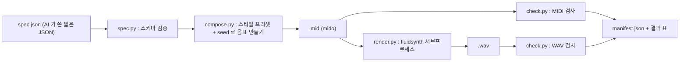

# BGM 툴 설계 (2026-08-25)

> 대상 : `soundtool bgm` — 짧은 JSON 을 받아 게임용 배경음 WAV 를 굽는 갈래.
> 입력값이 된 문서 : `Design/2026-08-20-사운드툴결정사항.md` · `Research/2026-08-19-사운드툴조사.md` ·
> `Research/2026-08-25-BGM배포조건조사.md`. **여기 적힌 결정은 뒤집지 않았다.**
> 코드는 아직 없다. 이 문서는 구현 에이전트가 그대로 따라 만들 수 있게 쓴 설계다.

---

## 구현 뒤 달라진 것 (2026-08-25)

**설계대로 다 만들었고, 실측 때문에 바뀐 것이 아래 표다.** 아래 값이 진실이고 본문은 그에 맞춰 고쳤다.
표에 없는 것은 설계 그대로다.

| 무엇 | 설계 | 실제 | 왜 |
| --- | --- | --- | --- |
| 곡 끝 처리 | `loop` 곡만 자른다 | **모든 곡을 자른다** | FluidSynth 가 MIDI 끝에서 안 멈추고 **내용과 상관없이 3.03초 꼬리**를 붙인다 (`-R 0 -C 0` 이어도 같다). 안 자르면 길이 검사가 비loop 곡에서 다 떨어진다. 자른 뒤 길이는 loop 곡이 기대치 정확히, 비loop 곡이 기대치 +2.0초다 |
| `-g` 기본값 | 0.6 (짐작) | **1.35** | 스타일 8곡을 g 1.2 · 1.35 · 1.5 로 다 구워 피크를 쟀다. 1.5 는 victory 가 풀스케일에 닿고, 1.2 는 조용한 스타일이 −8 dBFS 까지 내려간다 |
| 출력 채널 | 안 적었다 | **스테레오 2채널** | FluidSynth 기본이 스테레오다. 모노로 접으면 사운드폰트의 좌우 배치가 뭉개진다. 검수는 두 채널 평균 파형으로 잰다 |
| 검수 7 (루프 이음매) | 첫 50ms RMS 와 끝 50ms RMS 의 **비가 0.5~2.0** | **첫 50ms · 끝 50ms 가 각각 ≥ −45 dBFS** 인지만 본다. 끝 50ms 는 일부러 비운 마지막 16분음표 **앞**에서 잰다 | 비로 재면 마지막 마디를 16분음표 하나 앞에서 끊는 우리 규칙(4-4) 때문에 끝이 늘 조용해서 정상 곡이 다 떨어진다. 잡고 싶은 것은 「양 끝이 뚝 끊겼나」다 |
| 검수 8 (대역 분포) 아래 문턱 | 저·중·고 **각각 2%** | **저 2% · 중 10% · 고 0.02%** | GM 사운드폰트로 구운 배경음은 4kHz 위 에너지가 원래 0.06~1.9% 다. 2% 로 두면 정상 곡 8개가 전부 떨어진다. 실측(저 25~67% · 중 32~73% · 고 0.06~1.9%) 아래로 넉넉히 잡았다 |
| exe·sf2 가 없을 때 종료 코드 | 1 | **3** | SFX 갈래와 맞췄다. 「검수에 떨어졌다(1)」와 「도구가 없다(3)」는 부르는 쪽이 다르게 다뤄야 한다 |
| `chord_pitches` | `(roman, key, mode)` | **`(roman, key)`** | 로마숫자가 이미 화음의 성질(대문자·소문자)을 담아서 `mode` 를 다시 받을 자리가 없었다 |
| 코드 슬롯 | 마디마다 하나 | **박마다 하나** | 마디 단위로는 진행 넷을 16마디에 네 번 반복하는 것밖에 못 한다. 박 단위로 두면 반 마디 코드도 된다 |
| 진행 검사 | 없었다 | 진행이 **조·선법에서 2음 이상 벗어나면 스펙 오류** | 스펙에 아무 로마숫자나 적으면 조성이 무너진 곡이 조용히 나온다 |
| manifest | `items` 만 | **`kinds[갈래]` 머리 + `tracks` 열쇠 + `version` 2** (7-2) | SFX 와 한 파일을 나눠 쓰게 됐다. `bgm check` 가 `tracks` 로 켠 트랙을 되살린다 |

**남은 문제 : 스타일 사이 음량 차가 8 dB 다** (RMS −15.1 ~ −19.7 dBFS). 스타일별 gain 이나 후처리 정규화가 필요하다.

## 0. 한 줄 결론

**AI 는 곡 하나를 열 줄짜리 JSON 으로만 적는다.** 스타일 이름과 seed 를 받아 음표를 다 만드는 것은 코드다.
`spec.json` → mido 로 MIDI → FluidSynth 로 WAV → 코드 검수 → 산출 폴더 + `manifest.json` 까지가 한 명령이다.

---

## 1. 흐름



- **MIDI 파일도 산출 폴더에 같이 남긴다.** 소리가 이상할 때 음표가 문제인지 사운드폰트가 문제인지
  가르는 유일한 방법이고, 사운드폰트만 바꿔 다시 굽는 것도 MIDI 가 있어야 한다.
- **각 단계는 앞 단계의 파일만 본다.** 중간에 메모리로 넘기는 상태가 없어서 어느 단계든 따로 다시 돌린다.
- **한 곡이 실패해도 다음 곡으로 넘어간다.** 다 돌린 뒤 결과 표에 「실패·이유」를 적고 종료 코드 1.

### 명령 꼴 (SFX 갈래와 맞춤)

```
python -m soundtool bgm make <spec.json> --out <폴더> [--fluidsynth <exe>] [--soundfont <sf2>] [--rate 44100] [--gain 0.6] [--midi-only]
python -m soundtool bgm check <폴더>          # 이미 구운 것을 다시 검사만
python -m soundtool bgm presets [--json]      # 스타일·모드·코드 표와 JSON 스키마를 찍는다
```

`presets` 가 있는 까닭 : **AI 에게 프롬프트로 넣을 목록을 코드가 스스로 뱉게 한다.** 문서와 코드가 어긋나지 않는다.

---

## 2. JSON 스펙

### 2-1. 생김새

```json
{
  "version": 1,
  "songs": [
    { "name": "town_market", "style": "town", "tags": ["town", "day"], "seed": 1041 },
    { "name": "boss_1", "style": "battle", "key": "A", "mode": "minor",
      "bpm": 152, "bars": 32, "seed": 7, "progression": ["i", "VI", "III", "VII"] }
  ]
}
```

**첫 곡처럼 네 줄이 기본이다.** 나머지는 프리셋과 seed 가 채운다.

### 2-2. 항목

| 항목 | 꼴 | 기본값 | 뜻 |
| --- | --- | --- | --- |
| `name` | 문자열, `^[a-z0-9_-]{1,48}$` | 필수 | 파일 이름이 된다. 경로 문자를 못 넣는다 |
| `style` | enum 6 | 필수 | `town` `battle` `dungeon` `title` `victory` `ambient` |
| `seed` | 정수 0..2147483647 | `name` 의 sha256 앞 4바이트 | 같은 값이면 늘 같은 곡 |
| `tags` | 문자열 배열 ≤ 8 | `[]` | Unity 쪽 태그 검색용. `manifest.json` 에 그대로 실린다 |
| `bpm` | 정수 40..240 | 스타일 범위에서 seed 로 뽑음 | |
| `key` | enum 12 (`C` `C#` … `B`) | 스타일 기본 | |
| `mode` | enum 5 | 스타일 기본 | `major` `minor` `dorian` `mixolydian` `phrygian` |
| `bars` | 정수 4..64, 4의 배수 | 스타일 기본 (대개 16) | 마디 수 |
| `loop` | 참/거짓 | 스타일 기본 (`victory` 만 거짓) | 참이면 끝을 매끈하게 만든다 (4-4 참고) |
| `progression` | 로마숫자 배열 2..8 | 스타일 후보에서 seed 로 뽑음 | 예 `["I","V","vi","IV"]` |
| `tracks` | 객체 (아래) | 다 켬 | 역할별 끄기·악기 덮어쓰기 |

`tracks` 는 `drums` `bass` `chords` `melody` 네 열쇠만 받고, 값은
`{ "on": true, "program": 0..127, "octave": -2..2 }` 다. 셋 다 선택이다.
GM 프로그램 번호는 **0부터 센다** (0 = Acoustic Grand Piano).

`progression` 에 쓸 수 있는 로마숫자는 이 열넷으로 **고정**한다 :
`I ii iii IV V vi` (장조) · `i III iv v VI VII bII` (단조) · `bVII` (둘 다).
목록을 고정해야 나중에 GBNF 로 바꿀 때 문법이 짧아지고, AI 가 못 쓰는 코드를 지어내지 못한다.

### 2-3. 스키마 파일

JSON Schema 2020-12 로 `SoundTool/src/soundtool/bgm/bgm.schema.json` 에 둔다.
전 항목 `additionalProperties: false`, 문자열은 전부 `pattern` 또는 `enum`.

**다만 돌 때 검사하는 것은 `spec.py` 의 손코드다.** `jsonschema` 패키지를 더하지 않는다 (의존 최소).
스키마 파일은 ① 문서 ② 나중에 GBNF 로 바꿀 원본 ③ `bgm presets --json` 출력용이다.
`spec.py` 는 스키마 파일과 같은 값을 상수로 갖고, 시험 하나가 **둘이 어긋나지 않았나**를 본다.

### 2-4. 왜 이 모양인가

| 물음 | 답 |
| --- | --- |
| 왜 음표를 AI 에게 안 적게 하나 | 4분짜리 곡 하나가 음표 수천 개다. 토큰 절약이라는 가장 큰 목적에 정면으로 어긋난다 |
| 그럼 다양성은 | `style × key × mode × bpm × progression × seed`. seed 만 바꿔도 다른 곡이 나온다 |
| AI 가 세밀하게 못 만지는데 | 첫 판은 **"늘 말이 되는 소리가 난다"** 가 표현력보다 위다. 모자라면 `tracks` 와 `progression` 으로 손댄다 |

---

## 3. 곡 만드는 규칙

### 3-1. 뼈대

- 박자는 **4/4 고정**. 첫 판에서 변박은 안 한다.
- 마디를 **4마디 악구(phrase)** 로 묶는다. `bars` 가 4의 배수인 까닭이다.
- 코드 진행은 악구 하나를 채운다. 진행 길이가 4면 마디마다 한 코드, 2면 두 마디씩, 8이면 반 마디씩이다.
- 역할 트랙은 넷 : **드럼 · 베이스 · 코드(패드) · 멜로디**.

### 3-2. 스타일 프리셋

| 스타일 | bpm | 기본 key/mode | 진행 후보 | 드럼 | 베이스 | 코드 | 멜로디 | GM (코드/베이스/멜로디) | 멜로디 음역 |
| --- | --- | --- | --- | --- | --- | --- | --- | --- | --- |
| `town` | 96–116 | C / major | `I V vi IV` · `I vi IV V` · `IV V I vi` | 가벼운 8비트 | 4분 루트 | 2분 지속 | 8분, 보통 | 4 / 33 / 73 | 60–84 |
| `battle` | 140–168 | A / minor | `i VI III VII` · `i iv V i` · `i VII VI V` | 16분 하이햇 + 매 박 킥 | 8분 루트-옥타브 | 8분 스탭 | 16분, 촘촘 | 81 / 38 / 80 | 60–88 |
| `dungeon` | 72–90 | D / phrygian | `i VI i VII` · `i iv i V` · `i bII i v` | 성김 (킥 + 탐) | 온음표 드론 | 온음표 패드 | 성김, 2분 | 89 / 43 / 71 | 55–79 |
| `title` | 80–100 | C / major | `I IV V I` · `vi IV I V` | **없음** | 2분 | 아르페지오 8분 | 긴 음 | 48 / 33 / 40 | 62–84 |
| `victory` | 120–140 | C / major | `I IV V I` · `I V I` | 팡파르 (크래시 + 스네어 롤) | 4분 | 4분 | 팡파르 8분 | 61 / 33 / 56 | 65–86 |
| `ambient` | 60–76 | E / dorian | `i IV i IV` · `i VII i VII` | **없음** | 온음표 | 아주 느린 패드 | 아주 성김 | 89 / 43 / 52 | 60–81 |

`victory` 만 `bars` 기본 8 · `loop` 거짓이다 (짧은 징글). 나머지는 `bars` 16 · `loop` 참.

### 3-3. 패턴 만들기

패턴은 **1마디짜리 셀** 로 적는다. 셀 하나 = `(박 위치, 길이, 세기)` 목록이다.
`patterns.py` 는 스타일마다 셀을 2~4개 갖고, 악구 안에서 `A A B A` 로 깐다.
같은 것이 두 번 나오고 세 번째만 달라지는 이 짜임이 **적은 재료로 곡처럼 들리게 하는 가장 싼 방법**이다.

- **드럼** : 셀을 그대로 쓴다. 8마디마다 마지막 마디에 필(fill) 셀을 넣는다.
- **베이스** : 셀의 박 위치는 그대로, 음높이는 그 자리 코드의 근음. 8분 패턴이면 근음/5도/옥타브를 번갈아 쓴다.
- **코드** : 그 자리 코드의 3화음을 쌓는다. 아르페지오 패턴이면 낮은음부터 차례로 흩는다.
- **멜로디** : 리듬은 셀에서, 음높이는 아래 규칙으로 뽑는다.

### 3-4. 멜로디 규칙 다섯

1. **음은 key+mode 의 음계 안에서만** 고른다.
2. **마디 첫 음은 그 자리 코드의 화음음(코드톤)** 으로 한다.
3. **도약 제한** — 앞 음과의 간격은 7반음(완전5도) 이내. 악구마다 한 번만 옥타브 도약을 허락한다.
4. **음역 밖이면 접는다** — 위로 넘치면 한 옥타브 내리고, 아래로 넘치면 올린다.
5. **끝 해결** — 마지막 마디의 마지막 음은 으뜸화음의 화음음. `loop` 이 참이면 그중에서도
   **1도 또는 5도**로 끝내서 첫 마디로 돌아갈 때 어색하지 않게 한다.

쉼표는 스타일 밀도에 따라 확률로 넣는다 (성김 40% · 보통 20% · 촘촘 8%).

### 3-5. seed 를 나누는 법

**트랙마다 난수 흐름을 따로 쓴다.** `random.Random(f"{seed}:{역할}")` 로 만든다.
그래야 `tracks.drums.on = false` 로 드럼만 껐을 때 **멜로디가 그대로 남는다.**
한 흐름을 같이 쓰면 드럼을 끄는 순간 곡 전체가 딴 곡이 된다.
(파이썬 `random.Random` 에 문자열을 주면 sha512 로 씨를 만든다. `PYTHONHASHSEED` 와 무관하게 늘 같다.)

### 3-6. 늘릴 자리

| 늘리고 싶은 것 | 어디를 고치나 |
| --- | --- |
| 새 스타일 | `patterns.py` 의 `STYLES` 표에 한 줄, `spec.py` 의 enum 에 한 줄 |
| 새 리듬 셀 | `patterns.py` 의 셀 목록에 넣기만 하면 `A A B A` 배치에 저절로 들어간다 |
| 새 트랙 역할 (예: 카운터 멜로디) | `patterns.py` 에 만드는 함수 + `compose.py` 의 채널 배정 표 + 스키마 `tracks` 열쇠 |
| 7화음 · 텐션 | `theory.py` 의 `chord_notes` 만 고친다. 다른 곳은 안 건드린다 |
| 변박 · 셋잇단 | **첫 판 밖.** 마디를 박 단위로 세는 자리(`compose.py`) 를 다 손봐야 한다 |

---

## 4. MIDI 세부

### 4-1. 파일 구조

- `MidiFile(type=1, ticks_per_beat=480)`. 480 이면 16분음표 = 120틱, 셋잇단도 정수로 떨어진다.
- 트랙 0 = 메타만 : `track_name` · `time_signature 4/4` · `set_tempo`(bpm 을 마이크로초로).
- 트랙 1~4 = 역할별. 켠 트랙만 만든다.

### 4-2. 채널·악기

| 역할 | 채널(0부터) | 프로그램 |
| --- | --- | --- |
| 멜로디 | 0 | 스타일 표 값, `tracks.melody.program` 이 있으면 덮어씀 |
| 코드 | 1 | 〃 |
| 베이스 | 2 | 〃 |
| 드럼 | **9** | `program_change` 를 **안 보낸다** (GM 에서 채널 10 은 타악기 고정) |

드럼 음 번호 : 킥 36 · 스네어 38 · 닫은 하이햇 42 · 열린 하이햇 46 · 라이드 51 · 크래시 49 ·
낮은 탐 45 · 높은 탐 47 · 타이코 116.

### 4-3. 세기(velocity)

| 역할 | 기준값 | 흔들기 |
| --- | --- | --- |
| 킥 | 100 | ±4 |
| 스네어 | 95 | ±5 |
| 하이햇 | 68 | ±8 (센 박은 +10) |
| 베이스 | 85 | ±5 |
| 코드 | 65 | ±5 |
| 멜로디 | 95 | ±6 |

흔들기는 seed 난수다. **코드와 멜로디의 차이(65 대 95)가 곡을 곡처럼 들리게 하는 가장 큰 한 가지다.**
값이 붙어 있으면 다 뭉개져서 들린다.

음 길이는 자리의 90% 까지만 채운다 (코드 95%, 스탭 패턴 50%). 붙여 두면 서로 겹쳐 뭉갠다.

### 4-4. 끝 처리

기대 길이 = `bars × 4 × 60 / bpm` 초.

- **`loop` 이 참이면** : ① 마지막 마디의 모든 음을 마디 끝보다 **16분음표 하나 앞에서** 끝낸다.
  ② `end_of_track` 을 루프 끝 tick 에 정확히 둔다. ③ 굽기를 **리버브·코러스 끄고**(`-R 0 -C 0`) 한다.
  잔향은 어차피 반복 재생 때 앞뒤가 안 맞으므로, 켜 두고 페이드하는 것보다 끄는 쪽이 맞다.
  기대 길이는 `bars × 4 × 60 / bpm` 초 그대로다.
- **`loop` 이 거짓이면** : 마지막 마디 뒤에 **빈 2초**를 두고 리버브를 켠 채 굽는다.
  기대 길이는 위 값 **+ 2.0초**다.
- **`loop` 과 상관없이 구운 WAV 를 기대 샘플 수로 정확히 자른다** (표준 `wave` 모듈로 다시 쓴다).
  **FluidSynth 가 MIDI 끝에서 안 멈추고 내용과 상관없이 3.03초 꼬리를 붙이기 때문이다.**
  `-R 0 -C 0` 을 줘도 붙는다. 길이 검사는 **자른 뒤에** 한다.

버린 대안 : 한 마디 더 굽고 꼬리를 머리에 크로스페이드하는 진짜 루프 만들기.
소리는 더 낫지만 numpy 로 파형을 섞는 코드가 붙고 검수도 어려워진다. **첫 판 밖.**

---

## 5. FluidSynth 호출

```
<exe> -ni -q -T wav -O s16 -r 44100 -g 1.35 [-R 0 -C 0] -F <out.wav> <sf2> <in.mid>
```

- `subprocess.run(리스트, shell=False, timeout=120)`. **셸을 안 거친다** (이름에 이상한 글자가 와도 안전).
- `-O s16` : Unity 가 바로 먹는 16비트. `-r 44100` 은 상수 + `--rate` 로 덮어쓴다.
- **`-g` 기본 1.35 (실측으로 정했다).** 스타일 8곡을 g 1.2 · 1.35 · 1.5 로 다 구워 피크를 쟀다.
  1.5 는 victory 가 풀스케일에 닿고, 1.2 는 조용한 스타일이 −8 dBFS 까지 내려간다. 1.35 면 피크가 대개 −3 ~ −1 dBFS 다.
  값은 `config.FLUIDSYNTH_GAIN` 에 있고 `--gain` 으로 덮는다.
- **출력은 스테레오 16비트다.** FluidSynth 기본이 스테레오고, 모노로 접으면 사운드폰트의 좌우 배치가 뭉개진다.
- **클리핑이 잡히면 `gain × 0.7` 로 딱 한 번만 다시 굽는다.** 두 번은 안 한다 (그때는 실패로 적는다).
  실제로 쓴 gain 을 `manifest.json` 에 적는다.

### 5-1. 경로

| 무엇 | 상수 (`render.py`) | 덮어쓰기 |
| --- | --- | --- |
| 실행 파일 | `SoundTool/bin/fluidsynth/bin/fluidsynth.exe` | `--fluidsynth` |
| 사운드폰트 | `SoundTool/bin/soundfont/GeneralUser-GS.sf2` | `--soundfont` |

상수는 **패키지 위치 기준 상대 경로**로 잡는다 (`Path(__file__).parents[3] / "bin" / …`).
툴 폴더 밖을 가리키지 않는다 (AGENTS 11).

### 5-2. 없을 때 · 실패할 때

| 일 | 어떻게 |
| --- | --- |
| exe 가 없다 | 곡을 하나도 안 굽고 바로 멈춘다. 「fluidsynth 를 못 찾았다 : `<경로>`. `--fluidsynth` 로 알려주거나 `Docs/Design/2026-08-25-BGM툴설계.md` 8장대로 설치해라」 · **종료 코드 3** (SFX 갈래와 맞췄다) |
| sf2 가 없다 | 위와 같다 |
| exe 가 오래 걸린다 | 120초 timeout → 그 곡만 실패 |
| exe 가 0 이 아닌 코드로 끝났다 | 그 곡 실패. stderr 앞 200자를 이유에 적는다 |
| exe 가 **0 으로 끝났는데 WAV 가 없거나 이상하다** | 그래도 실패. **exit code 를 안 믿고 산출 WAV 를 검사한다** |

`--midi-only` 를 주면 fluidsynth 를 아예 안 찾는다. MIDI 단계만 돌려 볼 때 쓴다.

---

## 6. 검수 기준

**전부 코드가 판정한다.** WAV 읽기는 표준 `wave` + `numpy`, 스펙트럼은 `numpy.fft.rfft` 다.
(`librosa` 는 Python 3.14 wheel 이 있는지 확인이 안 됐다. 우리가 쓸 것은 FFT 하나뿐이라 numpy 로 충분하다.)

| # | 무엇을 보나 | 문턱 | 왜 |
| --- | --- | --- | --- |
| 1 | 길이 | **꼬리를 자른 뒤에** 잰다. loop 곡 ±0.1% · 비loop 곡 ±3% | 굽다 끊긴 것·템포가 안 먹은 것을 잡는다. 자르기 전에 재면 3.03초 꼬리 때문에 다 떨어진다 (4-4) |
| 2 | 전체 RMS | ≥ 0.01 (약 −40 dBFS) | 사운드폰트를 못 읽거나 프로그램 번호가 빈 자리면 **무음 WAV 가 조용히 나온다** |
| 3 | 클리핑 | `\|x\| ≥ 0.99` 인 샘플이 전체의 0.01% 미만 | 음량이 깨진 것. 넘으면 gain 을 낮춰 한 번 다시 굽는다 |
| 4 | 앞뒤 200ms | 둘 중 하나라도 통째로 무음이면 실패 | 시작이 밀렸거나 꼬리가 잘렸다 |
| 5 | 트랙별 음표 수 (MIDI) | 켠 트랙마다 ≥ `bars` 개 | 패턴 버그로 빈 트랙이 나오는 것을 여기서 잡는다. **fluidsynth 없이도 돈다** |
| 6 | 음높이 범위 (MIDI) | 모든 음이 21..108 | 극단 음역은 사운드폰트가 소리를 안 내거나 이상하게 낸다 |
| 7 | 루프 이음매 | `loop` 참이면 **첫 50ms 와 끝 50ms 가 각각 ≥ −45 dBFS**. 끝 50ms 는 일부러 비운 마지막 16분음표 **앞**에서 잰다 | 잡고 싶은 것은 「양 끝이 뚝 끊겼나」다. RMS 비로 재면 4-4 규칙 때문에 끝이 늘 조용해서 정상 곡이 다 떨어진다 |
| 8 | 대역 분포 | 저(<250Hz)·중(250~4k)·고(>4k) 에너지 비가 위로 80% 아래. 아래 문턱은 **저 2% · 중 10% · 고 0.02%** | 저음만 붕붕대거나 고음만 쨍한 사고를 잡는다. GM 배경음은 4kHz 위가 원래 0.06~1.9% 라 셋 다 2% 로 두면 정상 곡이 전부 떨어진다 |

- 1·5·6 은 **틀리면 실패**. 2·3·4·7·8 도 실패다. **경고 등급은 두지 않는다** — 첫 판에서 경고를 두면 아무도 안 본다.
- `bgm check <폴더>` 는 `manifest.json` 을 읽어 같은 검사를 다시 돈다. WAV 만 있고 MIDI 가 없으면 5·6 은 건너뛴다.

---

## 7. 폴더·모듈 구조

```
SoundTool/
  src/soundtool/
    __main__.py        # python -m soundtool
    cli.py             # 갈래(sfx|bgm) 가르기
    manifest.py        # SFX 와 같이 쓰는 manifest 쓰기·읽기
    bgm/
      __init__.py
      spec.py          # 스키마·검증·Song
      theory.py        # 음계·코드
      patterns.py      # 스타일 표와 역할별 패턴
      compose.py       # 곡 조립 → mido.MidiFile
      render.py        # fluidsynth 호출
      check.py         # 검수
      bgm.schema.json
  Test/
    test_bgm_spec.py  test_bgm_theory.py  test_bgm_compose.py  test_bgm_check.py
    test_bgm_render.py   # fluidsynth 있을 때만
  bin/                 # git 제외. fluidsynth/ · soundfont/
  .venv/               # git 제외
```

### 7-1. 공개 함수

| 파일 | 함수 | 하는 일 |
| --- | --- | --- |
| `spec.py` | `load_spec(path: Path) -> list[Song]` | 파일을 읽고 검증해 `Song` 목록으로 |
| | `validate_song(obj: dict) -> list[str]` | 틀린 곳을 사람 말로. 빈 목록이면 통과 |
| | `Song` (dataclass) | 기본값이 다 채워진 곡 하나 |
| `theory.py` | `scale_pitches(key: str, mode: str) -> list[int]` | 음계의 음이름 번호 7개 |
| | `chord_pitches(roman: str, key: str) -> list[int]` | 3화음의 음이름 번호 3개. 로마숫자가 화음의 성질을 이미 담아서 `mode` 를 안 받는다 |
| | `fold_into(note: int, lo: int, hi: int) -> int` | 음역 밖이면 옥타브 단위로 접는다 |
| `patterns.py` | `STYLES: dict[str, StylePreset]` | 3-2 표를 그대로 옮긴 것 |
| | `make_drums(preset, rng, bars) -> list[Note]` | |
| | `make_bass(preset, rng, slots) -> list[Note]` | `slots` 는 마디별 코드 |
| | `make_chords(preset, rng, slots) -> list[Note]` | |
| | `make_melody(preset, rng, slots, song) -> list[Note]` | 3-4 규칙이 여기 있다 |
| `compose.py` | `compose(song: Song) -> mido.MidiFile` | 위 넷을 불러 MIDI 한 판으로 |
| | `plan_chords(song, rng) -> list[ChordSlot]` | 진행을 마디에 깐다 |
| `render.py` | `find_tools(opt) -> ToolPaths` | exe·sf2 를 찾고 없으면 오류 |
| | `render(mid: Path, wav: Path, song, opt) -> RenderResult` | 굽고, 클리핑이면 한 번 다시, loop 이면 자른다 |
| `check.py` | `check_midi(mid: Path, song) -> list[str]` | 5·6 번 |
| | `check_wav(wav: Path, song, gain) -> list[str]` | 1·2·3·4·7·8 번 |

`Note` 는 `(role, start_beat: float, length_beat: float, pitch: int, velocity: int)` 다.
**박 단위 float 로 다루다가 `compose.py` 에서 한 번만 tick 정수로 바꾼다.** 반올림 오차가 한 자리에만 생긴다.

### 7-2. manifest.json

SFX 와 열쇠 이름을 맞춘다. 앞 여섯은 두 갈래가 똑같다.

**SFX 와 BGM 이 이 파일 하나를 나눠 쓴다.** 갈래마다 다른 값(`channels` 는 SFX 1 · BGM 2)은
`kinds[갈래]` 에 모으고, `items` 는 두 갈래 것이 섞여 담긴다. `bgm make` 는 `kind` 가 `"bgm"` 인 항목만
갈아끼우고 `"sfx"` 항목은 건드리지 않는다 (`manifest.merge_write()`).

```json
{
  "version": 2,
  "bits": 16,
  "kinds": {
    "bgm": { "generated_by": "soundtool bgm make", "sample_rate": 44100, "channels": 2 }
  },
  "items": [
    { "name": "town_market", "file": "town_market.wav", "kind": "bgm",
      "tags": ["town", "day"], "seconds": 38.4, "seed": 1041,
      "midi": "town_market.mid", "style": "town", "bpm": 100,
      "key": "C", "mode": "major", "bars": 16, "loop": true, "gain": 1.35,
      "tracks": ["drums", "bass", "chords", "melody"],
      "peak_dbfs": -1.83, "rms_dbfs": -16.03 }
  ]
}
```

`tracks` 는 실제로 켠 트랙이다. `bgm check <폴더>` 가 이 값으로 곡을 되살려 5·6번 검사를 다시 돈다.

`kind` 는 `"sfx"` 또는 `"bgm"`. **실패한 곡은 `items` 에 안 넣는다** (Unity 가 없는 파일을 집지 않게).
실패는 결과 표와 종료 코드로만 알린다.

### 7-3. 시험

- **MIDI 단계 시험은 fluidsynth 없이 돈다** — 음표 수·길이·음역·seed 재현성(같은 seed 두 번 → 같은 바이트)을 본다.
- **렌더 시험은 exe 가 있을 때만** 돈다 (`pytest.mark.skipif`). 없다고 빨갛게 되면 아무도 안 돌린다.
- 스키마 시험 : `bgm.schema.json` 과 `spec.py` 의 enum·범위가 같은지.
- 골든 시험 : 스타일 6개를 `seed=1` 로 만든 MIDI 의 sha256 을 박아 둔다. 패턴을 건드리면 이 시험이 먼저 깨진다.

---

## 8. 설치 절차

**구현 단계에서 사용자 승인을 받고 한다. 지금은 아무것도 안 깔았다.**

1. **FluidSynth 2.6.0**
   <https://github.com/FluidSynth/fluidsynth/releases> 에서 `fluidsynth-v2.6.0-win10-x64-cpp11.zip` (2.6 MB).
   풀어서 `SoundTool/bin/fluidsynth/` 에 통째로 둔다 → `SoundTool/bin/fluidsynth/bin/fluidsynth.exe`.
   **exe·dll 을 고치지 않는다** (LGPL). zip 안의 `LICENSE` 를 같이 둔다.
2. **GeneralUser GS 2.0.3**
   <https://github.com/mrbumpy409/GeneralUser-GS> 에서 `GeneralUser-GS.sf2` (30.8 MB) 와
   `documentation/LICENSE.txt` 를 받아 `SoundTool/bin/soundfont/` 에 둔다.
3. **Python** : `py -3.14 -m venv SoundTool/.venv` 뒤 `numpy` · `mido` · `pytest` 를 넣는다.
   `mido` 1.3.3 은 순수 Python 이라 3.14 에서 깔린다 (조사 문서 2-4).
4. **`.gitignore`** : `SoundTool/.gitignore` 에 `bin/` 은 이미 있다. **`.venv/` 와 `Out/` 를 더한다.**
5. **`SoundTool/THIRD-PARTY.md`** 를 만들어 조사 문서 1장 표 네 줄을 옮겨 적는다.

첫 굽기에서 볼 것 둘 : ① WAV 가 생기는가 ② 피크가 얼마인가(→ `-g` 기본값 확정).

---

## 9. 구현 소단계와 공수

`Docs/History/공수기록.md` 의 눈금을 따랐다. 「설계가 문장까지 정한 문서 구현은 ×0.5」 를 코드에도 적용하되,
**「값을 재서 정한다」가 든 8·9 번은 ×2** 로 잡았다.

| 소단계 | 예상 | 시험 방법 |
| --- | --- | --- |
| 1. 패키지 뼈대 + `spec.py` + 스키마 파일 | 40분 | `test_bgm_spec.py` — 좋은 스펙 6개·나쁜 스펙 10개 |
| 2. `theory.py` | 25분 | 음계·화음 값을 손으로 적은 표와 맞춰본다 |
| 3. `patterns.py` (스타일 6개 표) | 60분 | 셀마다 박 위치가 마디를 안 넘는지 |
| 4. `compose.py` | 50분 | 음표 수·길이·음역·같은 seed 재현성 |
| 5. `render.py` | 40분 | exe 없을 때 오류 문구, `--midi-only` |
| 6. `check.py` (문턱 8개) | 50분 | 일부러 깨뜨린 WAV 를 만들어 8개가 각각 잡히는지 |
| 7. `cli.py` + `manifest.py` + 결과 표 | 30분 | 실패 한 곡을 섞어 종료 코드 1 확인 |
| 8. 설치 + 첫 굽기 · gain 실측 | 40분 | 피크·RMS 를 재서 `-g` 기본값 확정 |
| 9. 스타일 6개 굽고 들어보고 프리셋 손보기 | 60분 | **사람이 들어야 한다** |
| **합** | **약 5시간 55분** | |

8·9 는 FluidSynth 설치 승인이 있어야 시작한다. 1~7 은 지금 바로 된다.

---

## 10. 이번에 정한 것

| # | 결정 | 버린 대안 | 왜 |
| --- | --- | --- | --- |
| 1 | 사운드폰트는 **GeneralUser GS 2.0.3**, 자산 라이선스 규칙(CC0·CC-BY·OGA-BY)의 **예외**로 둔다 | MuseScore General(MIT) | 사운드폰트는 자산이 아니라 자산을 만드는 도구다. CC0 짜리 쓸 만한 GM 폰트가 없다. 30.8 MB 로 더 작다 |
| 2 | FluidSynth·사운드폰트를 **키트 안 `bin/`** 에 둔다 (git 제외) | PATH 설치 · 받는 스크립트 | 툴 폴더가 그 자체로 완결돼야 한다. GeneralUser GS 는 "직접 링크 걸지 말라"는 부탁이 있다 |
| 3 | AI 는 **곡당 열 줄 JSON** 만 쓴다. 음표는 코드가 만든다 | AI 가 음표 배열을 뱉기 · abc notation | 토큰 절약이 가장 큰 목적이다. 결정사항 문서에 이미 정해져 있다 |
| 4 | 역할 트랙 **넷 고정** (드럼·베이스·코드·멜로디) | 트랙 수를 스펙에서 정하기 | 채널 배정·검수·프리셋 표가 단순해진다. 늘릴 자리는 3-6 에 적었다 |
| 5 | 악구 안 셀 배치는 **`A A B A`** | 마디마다 새로 뽑기 | 반복이 있어야 곡으로 들린다. 재료가 적어도 된다 |
| 6 | 트랙마다 **난수 흐름을 따로** 쓴다 | 곡 하나에 흐름 하나 | 트랙 하나를 껐을 때 나머지가 그대로 남는다 |
| 7 | `loop` 곡은 **리버브 끄고 굽고 기대 샘플 수로 자른다** | 한 마디 더 굽고 크로스페이드 | 코드가 열 줄이면 끝난다. 크로스페이드는 검수가 어렵다 |
| 8 | 검수는 **numpy.fft** 로 한다 | librosa | Python 3.14 wheel 이 불확실하다. 쓸 것은 FFT 하나뿐이다 |
| 9 | 스키마 검증은 **손코드**, 스키마 파일은 문서·GBNF 원본 | `jsonschema` 패키지 | 의존을 하나라도 덜 늘린다. 어긋남은 시험이 잡는다 |
| 10 | 로마숫자를 **열넷으로 고정** | 자유 문자열 | GBNF 문법이 짧아지고 AI 가 없는 코드를 못 지어낸다 |
| 11 | `-g` 기본 **0.6**, 클리핑이면 0.7배로 **한 번만** 다시 굽기 | 고정 gain · 정규화 후처리 | 기본 0.2 는 너무 작다. 0.6 은 **아직 안 잰 값** — 8번 소단계에서 확정한다 |
| 12 | 실패한 곡은 `manifest.json` 에 **안 넣는다** | 실패도 넣고 표시 | Unity 가 없는 파일을 집으면 런타임에 터진다 |
| 13 | 4/4 · 3화음 · 변박 없음 | 변박·7화음·텐션 | 첫 판은 표현력보다 "늘 말이 되는 소리" 가 위다 |

## 11. 못 정한 것

| 무엇 | 왜 못 정했나 | 언제 정하나 |
| --- | --- | --- |
| `-g` 기본값이 정말 0.6 인가 | 아직 안 구워 봤다 | 소단계 8 |
| 소리 품질이 쓸 만한가 | **사람이 들어야 안다** | 소단계 9 |
| 칩튠(8비트)이 필요한가 | 게임 장르가 아직 안 정해졌다 | 장르 결정 뒤. 필요하면 사운드폰트만 바꿔 본다 |
| Unity 에 WAV 로 줄까 OGG 로 줄까 | 용량 대 로딩 시간을 재봐야 한다 | Unity 쪽 붙일 때 |
| 루프 지점 메타데이터 (`LOOP_START` 등) | Unity 재생 쪽 설계가 아직 없다 | Unity 쪽 붙일 때 |
| 미니PC 에서 fluidsynth 가 도는가 | 미니PC 가 아직 없다 | 도착 뒤 |
