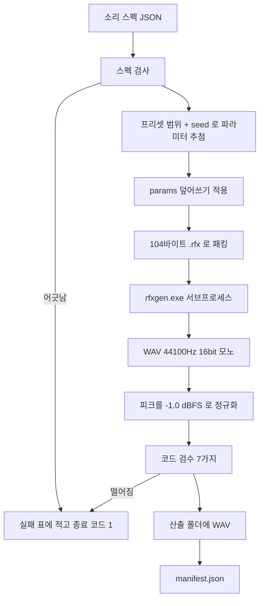

# SFX 툴 설계

> 설계일 : 2026-08-25
> 입력 : `Design/2026-08-20-사운드툴결정사항.md` · `Research/2026-08-20-SFX엔진재조사.md` · `Research/2026-08-25-rfx엔디안확인.md`
> 범위 : **SFX 만.** BGM 은 자리만 비워 둔다.
> 이 문서는 설계다. 코드는 없다. 구현은 9절 소단계대로 한다.

---

## 구현 뒤 달라진 것 (2026-08-25)

**설계대로 다 만들었고, 실측 때문에 바뀐 것이 아래 표다.** 아래 값이 진실이고 본문은 그에 맞춰 고쳤다.
표에 없는 것은 설계 그대로다.

| 무엇 | 설계 | 실제 | 왜 |
| --- | --- | --- | --- |
| manifest 항목 열쇠 | `sounds` | **`items` + 항목마다 `kind: "sfx"`** | BGM 갈래가 같은 파일을 나눠 쓴다. 갈래를 섞어 담으려면 이름이 중립이어야 한다 |
| manifest 머리 | `sample_rate` · `channels` · `generated_by` 를 머리에 | **`kinds[갈래]` 안으로 옮기고 `version` 을 2 로** | SFX 는 모노 1, BGM 은 스테레오 2 다. 머리에 하나만 두면 같은 `--out` 에 두 갈래를 구울 때 나중 것이 앞 것을 덮어쓴다 |
| manifest 쓰기 | 통째로 새로 쓴다 | **`manifest.merge_write()` 로 같은 `kind` 만 갈아끼운다** | 위와 같은 이유. 다른 갈래 항목은 그대로 남는다 |
| centroid 기대 구간 | seed 24개 표본 | **seed 256개 재측정값** (5절 표) | 설계 소단계 8 이 시킨 대로 다시 쟀다. 프리셋 7개 × 256 = 1792개 |
| DC 문턱 | 10% (실측 최대 0.082) | **10% 그대로** (실측 최대 **0.212**, explosion) | 표본을 키우니 최대가 커졌지만, 문턱을 안 올려도 1792개 중 10개(0.56%)만 떨어진다. **자를 옮기지 않았다** |
| 클리핑 문턱 | 연속 4샘플 (실측 최대 1) | **연속 4샘플 그대로** (실측 최대 **65샘플**, explosion) | 위와 같다. 떨어지는 것은 진짜로 잘린 소리다 |
| DC·클리핑 재는 시점 | 안 적었다 | **정규화 전 파형에서 잰다** | 정규화하면 DC 도 같은 배수로 커져서 문턱의 뜻이 흐려진다. `check.check()` 가 `expect["dc"]`·`expect["clip_run"]` 으로 정규화 전 값을 받는다 |
| rfxgen 호출 | timeout 안 적었다 | **`subprocess` timeout 30초** | 조용히 매달리면 굽기가 통째로 멈춘다 |
| CLI 자리 | `__main__.py` 가 명령 셋을 다 갖는다 (6절 구조) | **`cli.py` 가 갈래를 가르고 `sfx/cli.py` 가 명령 셋을 갖는다. `__main__.py` 는 세 줄** | BGM 갈래가 붙으면서 갈래 가르기가 따로 필요해졌다 |
| 공용 모듈 | 없었다 | **`config.py` · `manifest.py` · `schema.py` · `table.py`** 를 두 갈래가 같이 쓴다 | 스키마 검사기와 표 찍기가 두 벌이 될 뻔했다 |
| 시험 파일 | 넷 | **일곱** (`test_rfx` `test_presets` `test_dsp` `test_check` `test_make` `test_spec` `test_cli`) | `dsp` · `make` · `spec` 을 따로 떼는 편이 실패 자리를 빨리 짚는다 |

종료 코드(0/1/2/3)와 「외부 라이브러리 0개」는 설계 그대로다.

---

## 0. 결론 먼저

**AI 는 짧은 JSON 만 뱉고, 파이썬이 `.rfx` 를 찍어 `rfxgen.exe` 로 굽고, 코드가 검수해서 통과한 것만 내보낸다.**

- 프리셋 7개(coin·laser·explosion·powerup·hit·jump·blip)는 **범위 + seed 결정론적 추첨**이다.
  같은 스펙이면 항상 같은 WAV 가 나온다. **바이트 단위로 같다는 것을 실측했다.**
- 검수 문턱은 짐작이 아니라 **프리셋 7개 × seed 24개 = 168개를 실제로 구워서 잰 값**으로 정했다.
- **외부 라이브러리를 하나도 안 쓴다.** numpy 도 안 쓴다. 파이썬 표준 라이브러리만으로 충분함을 실측으로 확인했다
  (스펙트럼 중심 계산이 소리 하나당 3~58ms). 설치 승인 받을 것이 없다.
- **rfxgen 은 exit 0 으로 조용히 실패한다.** 그래서 나온 WAV 의 **프레임 수**로 성공을 판정한다.

---

## 1. 전체 흐름



각 칸이 모듈 하나에 대응한다 (6절).

**왜 이 순서인가** — rfxgen 은 파일로만 주고받는다. 표준입력을 안 받는다. 그래서 `.rfx` 임시 파일 →
WAV 파일이 강제된다. 임시 `.rfx` 는 산출 폴더가 아니라 `tempfile.TemporaryDirectory()` 에 만들고 지운다.

---

## 2. JSON 스펙 스키마

### 왜 이렇게 단순한가

나중에 llama.cpp 의 `json_schema_to_grammar` 로 GBNF 를 만들어 로컬 LLM 출력을 강제한다.
그 변환기가 잘 다루는 것만 쓴다 — **`enum` · `type` · `minimum`/`maximum` · `required` · `items`**.
`oneOf` · `$ref` · `patternProperties` · 조건부(`if`/`then`)는 안 쓴다. GBNF 가 커지거나 변환이 깨진다.

### 스키마 (draft 2020-12)

`SoundTool/src/soundtool/sfx/spec_schema.json` 에 둔다. 뼈대는 이렇다.

```json
{
  "$schema": "https://json-schema.org/draft/2020-12/schema",
  "title": "SFX 소리 스펙",
  "type": "object",
  "required": ["sounds"],
  "additionalProperties": false,
  "properties": {
    "version": { "type": "integer", "minimum": 1, "maximum": 1 },
    "sounds": {
      "type": "array",
      "minItems": 1,
      "maxItems": 64,
      "items": { "$comment": "아래 sound 객체" }
    }
  }
}
```

`sounds` 의 각 항목(`sound`)은 이렇다.

| 열쇠 | 형 | 필수 | 값 | 뜻 |
| --- | --- | --- | --- | --- |
| `name` | string | **필수** | `^[a-z0-9_]{2,32}$` | 파일 이름이 된다. 소문자·숫자·밑줄만 |
| `preset` | string(enum) | **필수** | `coin` `laser` `explosion` `powerup` `hit` `jump` `blip` | 3절 |
| `seed` | integer | **필수** | 0 ~ 2147483647 | 결정성. 같은 seed = 같은 소리 |
| `tags` | array\<string\> | 선택 | 1~8개, `^[a-z0-9_]{2,24}$` | Unity 쪽 검색용 (8절) |
| `params` | object | 선택 | 아래 23개 중 일부 | 추첨 결과를 **덮어쓴다** |
| `check` | object | 선택 | 아래 4개 | 검수 문턱을 이 소리만 바꾼다 |

`params` 안의 열쇠는 rfxgen 필드명에서 `Value` 만 떼고 snake_case 로 바꾼 것이다. **1:1 로 보인다.**

| snake_case (우리) | rfxgen 필드 | 형 | 범위 | 기본값 |
| --- | --- | --- | --- | --- |
| `wave_type` | `waveTypeValue` | integer | 0~3 (0 사각 · 1 톱니 · 2 사인 · 3 노이즈) | 0 |
| `attack_time` | `attackTimeValue` | number | 0 ~ 1 | 0.0 |
| `sustain_time` | `sustainTimeValue` | number | 0 ~ 1 | 0.3 |
| `sustain_punch` | `sustainPunchValue` | number | 0 ~ 1 | 0.0 |
| `decay_time` | `decayTimeValue` | number | 0 ~ 1 | 0.4 |
| `start_frequency` | `startFrequencyValue` | number | 0 ~ 1 | 0.3 |
| `min_frequency` | `minFrequencyValue` | number | 0 ~ 1 | 0.0 |
| `slide` | `slideValue` | number | **-1 ~ 1** | 0.0 |
| `delta_slide` | `deltaSlideValue` | number | **-1 ~ 1** | 0.0 |
| `vibrato_depth` | `vibratoDepthValue` | number | 0 ~ 1 | 0.0 |
| `vibrato_speed` | `vibratoSpeedValue` | number | 0 ~ 1 | 0.0 |
| `change_amount` | `changeAmountValue` | number | **-1 ~ 1** | 0.0 |
| `change_speed` | `changeSpeedValue` | number | 0 ~ 1 | 0.0 |
| `square_duty` | `squareDutyValue` | number | 0 ~ 1 | 0.0 |
| `duty_sweep` | `dutySweepValue` | number | **-1 ~ 1** | 0.0 |
| `repeat_speed` | `repeatSpeedValue` | number | 0 ~ 1 | 0.0 |
| `phaser_offset` | `phaserOffsetValue` | number | **-1 ~ 1** | 0.0 |
| `phaser_sweep` | `phaserSweepValue` | number | **-1 ~ 1** | 0.0 |
| `lpf_cutoff` | `lpfCutoffValue` | number | 0 ~ 1 | **1.0** |
| `lpf_cutoff_sweep` | `lpfCutoffSweepValue` | number | **-1 ~ 1** | 0.0 |
| `lpf_resonance` | `lpfResonanceValue` | number | 0 ~ 1 | 0.0 |
| `hpf_cutoff` | `hpfCutoffValue` | number | 0 ~ 1 | 0.0 |
| `hpf_cutoff_sweep` | `hpfCutoffSweepValue` | number | **-1 ~ 1** | 0.0 |

**범위 근거** : `rfxgen.c` 741~769줄의 `GuiSliderBar()` 호출 마지막 두 인자가 그 슬라이더의 최소·최대다.
그걸 그대로 옮겼다. **`randSeed` 는 `params` 에 없다** — 우리가 `seed` 에서 만든다 (3절).
기본값은 `rfxgen.h` `ResetWaveParams()` 값이다. **`lpf_cutoff` 만 1.0 이다. 0 으로 두면 소리가 안 난다.**

`check` 는 이 소리만 문턱을 바꾼다. 없으면 프리셋 기본값을 쓴다.

| 열쇠 | 형 | 뜻 |
| --- | --- | --- |
| `min_seconds` | number 0~10 | 이보다 짧으면 실패 |
| `max_seconds` | number 0~10 | 이보다 길면 실패 |
| `centroid_hz` | array\<number\> 길이 2 | 스펙트럼 중심 허용 구간 |
| `skip` | array\<string\> | 이 소리에서 건너뛸 검수 항목 이름 |

### 스펙 보기

```json
{
  "version": 1,
  "sounds": [
    { "name": "ui_click", "preset": "blip", "seed": 1001, "tags": ["ui", "click"] },
    { "name": "coin_pickup", "preset": "coin", "seed": 2002, "tags": ["item", "pickup"] },
    { "name": "boss_boom", "preset": "explosion", "seed": 3003, "tags": ["boss", "impact"],
      "params": { "decay_time": 0.9, "lpf_cutoff": 0.7 },
      "check": { "max_seconds": 1.5 } }
  ]
}
```

**AI 가 뱉는 것은 보통 첫 두 줄 꼴이다** — 이름·프리셋·seed·태그 넷뿐이다. 소리 하나에 40토큰이 안 든다.

### 검사기는 표준 라이브러리로 직접 쓴다

`jsonschema` 패키지를 안 쓴다. 우리 스키마가 쓰는 문법이 위 여섯 가지뿐이라 검사기가 100줄이 안 된다.
`spec_schema.json` 파일은 **GBNF 변환기에 먹이는 용도**로 그대로 두고, 파이썬은 같은 규칙을 손으로 검사한다.
둘이 어긋나지 않게 **스키마 파일을 읽어 검사하는 방식**으로 짠다 (한 곳만 고치면 된다).

---

## 3. 프리셋

### 추첨 방식

```
rng = random.Random(seed)
params = 프리셋 함수(rng)        # 아래 표의 범위대로 뽑는다
rand_seed = rng.randint(1, 0xFFFE)   # 같은 rng 에서 이어서 뽑는다
```

**`randSeed` 를 왜 따로 뽑나** — `rfxgen.h` 273줄이 `if (params.randSeed != 0) RFXGEN_SRAND(params.randSeed);` 다.
이 값은 **노이즈 버퍼 32칸**만 정한다(`rfxgen.h` 359줄). 그래서 노이즈 파형(`wave_type` 3, explosion)에서만
소리가 달라진다. **0 이면 srand 를 안 불러 실행마다 노이즈가 달라진다 → 반드시 1 이상으로 넣는다.**

**결정성 실측** : explosion(노이즈) 프리셋을 같은 `.rfx` 로 두 번 구웠더니 WAV 의 SHA-256 앞 16자리가
`a30a2edf725a2c41` 로 **같았다.**

> **주의** : `randSeed` 는 C 표준 `rand()` 를 돌린다. 같은 rfxgen 빌드에서는 늘 같지만
> **다른 OS·libc 에서는 노이즈 파형이 달라질 수 있다.** 노이즈를 쓰는 explosion 만 해당된다.
> 골든 값을 잴 때 이걸 기억한다 (6절 시험).

### rfxgen 소스에서 옮긴 범위표

근거는 `rfxgen.h` 712~919줄의 `GenPickupCoin` · `GenLaserShoot` · `GenExplosion` · `GenPowerup` ·
`GenHitHurt` · `GenJump` · `GenBlipSelect` 일곱 함수다. `RFXGEN_RANDF(r)` 은 `[0, r]` 균등추첨,
`RFXGEN_RAND01` 은 반반 동전이다.

적지 않은 필드는 전부 2절 기본값 그대로다.

**coin** (`GenPickupCoin`)

| 필드 | 값 |
| --- | --- |
| `start_frequency` | 0.4 + U(0, 0.5) |
| `attack_time` | 0.0 |
| `sustain_time` | U(0, 0.1) |
| `decay_time` | 0.1 + U(0, 0.4) |
| `sustain_punch` | 0.3 + U(0, 0.3) |
| 50% 확률로 | `change_speed` = 0.5 + U(0, 0.2), `change_amount` = 0.2 + U(0, 0.4) |

**laser** (`GenLaserShoot`)

| 필드 | 값 |
| --- | --- |
| `wave_type` | 0~2 중 하나. 2 가 나오면 50% 확률로 0~1 로 다시 뽑는다 |
| 갈래 A (2/3) | `start_frequency` = 0.5 + U(0, 0.5), `min_frequency` = max(0.2, start − 0.2 − U(0, 0.6)), `slide` = −0.15 − U(0, 0.2) |
| 갈래 B (1/3) | `start_frequency` = 0.3 + U(0, 0.6), `min_frequency` = U(0, 0.1), `slide` = −0.35 − U(0, 0.3) |
| 듀티 50% | `square_duty` = U(0, 0.5), `duty_sweep` = U(0, 0.2) |
| 듀티 나머지 | `square_duty` = 0.4 + U(0, 0.5), `duty_sweep` = −U(0, 0.7) |
| `attack_time` | 0.0 |
| `sustain_time` | 0.1 + U(0, 0.2) |
| `decay_time` | U(0, 0.4) |
| 50% 확률로 | `sustain_punch` = U(0, 0.3) |
| 1/3 확률로 | `phaser_offset` = U(0, 0.2), `phaser_sweep` = −U(0, 0.2) |
| 50% 확률로 | `hpf_cutoff` = U(0, 0.3) |

**explosion** (`GenExplosion`)

| 필드 | 값 |
| --- | --- |
| `wave_type` | 3 (노이즈) 고정 |
| 갈래 A (50%) | `start_frequency` = 0.1 + U(0, 0.4), `slide` = −0.1 + U(0, 0.4) |
| 갈래 B (50%) | `start_frequency` = 0.2 + U(0, 0.7), `slide` = −0.2 − U(0, 0.2) |
| 그 뒤 | `start_frequency` 를 **제곱한다** |
| 20% 확률로 | `slide` = 0 |
| 50% 확률로 | `repeat_speed` = 0.3 + U(0, 0.5) |
| `attack_time` | 0.0 |
| `sustain_time` | 0.1 + U(0, 0.3) |
| `decay_time` | U(0, 0.5) |
| 50% 확률로 | `phaser_offset` = −0.3 + U(0, 0.9), `phaser_sweep` = −U(0, 0.3) |
| `sustain_punch` | 0.2 + U(0, 0.6) |
| 50% 확률로 | `vibrato_depth` = U(0, 0.7), `vibrato_speed` = U(0, 0.6) |
| 50% 확률로 | `change_speed` = 0.6 + U(0, 0.3), `change_amount` = 0.8 − U(0, 1.6) |

**powerup** (`GenPowerup`)

| 필드 | 값 |
| --- | --- |
| 50% | `wave_type` = 1 (톱니) / 나머지 50% 는 `square_duty` = U(0, 0.6) |
| 갈래 A (50%) | `start_frequency` = 0.2 + U(0, 0.3), `slide` = 0.1 + U(0, 0.4), `repeat_speed` = 0.4 + U(0, 0.4) |
| 갈래 B (50%) | `start_frequency` = 0.2 + U(0, 0.3), `slide` = 0.05 + U(0, 0.2), 그중 50% 는 `vibrato_depth` = U(0, 0.7) · `vibrato_speed` = U(0, 0.6) |
| `attack_time` | 0.0 |
| `sustain_time` | U(0, 0.4) |
| `decay_time` | 0.1 + U(0, 0.4) |

**hit** (`GenHitHurt`)

| 필드 | 값 |
| --- | --- |
| `wave_type` | 0~2 중 하나, 2 는 3(노이즈)으로 바꾼다 |
| `wave_type` 0 이면 | `square_duty` = U(0, 0.6) |
| `start_frequency` | 0.2 + U(0, 0.6) |
| `slide` | −0.3 − U(0, 0.4) |
| `attack_time` | 0.0 |
| `sustain_time` | U(0, 0.1) |
| `decay_time` | 0.1 + U(0, 0.2) |
| 50% 확률로 | `hpf_cutoff` = U(0, 0.3) |

**jump** (`GenJump`)

| 필드 | 값 |
| --- | --- |
| `wave_type` | 0 (사각) 고정 |
| `square_duty` | U(0, 0.6) |
| `start_frequency` | 0.3 + U(0, 0.3) |
| `slide` | 0.1 + U(0, 0.2) |
| `attack_time` | 0.0 |
| `sustain_time` | 0.1 + U(0, 0.3) |
| `decay_time` | 0.1 + U(0, 0.2) |
| 50% 확률로 | `hpf_cutoff` = U(0, 0.3) |
| 50% 확률로 | `lpf_cutoff` = 1.0 − U(0, 0.6) |

**blip** (`GenBlipSelect`)

| 필드 | 값 |
| --- | --- |
| `wave_type` | 0 또는 1 |
| `wave_type` 0 이면 | `square_duty` = U(0, 0.6) |
| `start_frequency` | 0.2 + U(0, 0.4) |
| `attack_time` | 0.0 |
| `sustain_time` | 0.1 + U(0, 0.1) |
| `decay_time` | U(0, 0.2) |
| `hpf_cutoff` | 0.1 |

### rfxgen 의 추첨 매크로에 버그가 있다 — 우리는 안 따라 한다

`rfxgen.h` 180줄 : `#define RFXGEN_RAND(min, max) ((rand()%(max - min) + 1) + min)`

`+ 1` 이 안쪽에 붙어 있어 **`RFXGEN_RAND(0, 2)` 는 1 아니면 2 를 준다. 0 이 절대 안 나온다.**
그래서 소스의 이런 갈래들이 **한 번도 실행되지 않는다.**

| 자리 | 죽은 갈래 |
| --- | --- |
| `GenLaserShoot` | `if (RFXGEN_RAND(0,2)==0)` 두 곳 — 갈래 B, 페이저 |
| `GenExplosion` | `RAND(0,4)==0` (slide=0), `RAND(0,2)==0` (repeat, change) |
| `GenHitHurt` | `wave_type` 이 {1,3} 만 나와 사각파 갈래와 `square_duty` 가 죽는다 |

**결정 : 우리는 원저자가 쓰려던 대로(모든 갈래가 살아 있게) 뽑는다.** 위 범위표가 그것이다.
버그를 그대로 베끼면 laser 는 늘 같은 갈래만 나오고 hit 는 사각파를 못 낸다 — 다양성이 준다.
**대신 rfxgen 이 `-g laser` 로 직접 만든 소리와는 분포가 다르다.** 우리 툴은 `.rfx` 를 직접 넘기므로 상관없다.

### 실측 — 프리셋별로 나온 소리 (seed 1~24, 프리셋마다 24개)

정규화 **전** 값이다. 검수 문턱의 근거다 (5절).

| 프리셋 | 프레임 | 초 | 피크 dBFS | RMS dBFS | 스펙트럼 중심 Hz | DC 최대 |
| --- | --- | --- | --- | --- | --- | --- |
| coin | 1219 ~ 24097 | 0.03 ~ 0.55 | −9.7 ~ 0.0 | −19.0 ~ −14.4 | 4944 ~ 7401 | 0.002 |
| laser | 2164 ~ 23366 | 0.05 ~ 0.53 | −13.6 ~ −4.4 | −19.9 ~ −11.5 | 1415 ~ 9383 | 0.082 |
| explosion | 1438 ~ 32818 | 0.03 ~ 0.74 | −5.4 ~ −0.8 | −18.8 ~ −8.7 | 2501 ~ 10448 | 0.053 |
| powerup | 1179 ~ 36755 | 0.03 ~ 0.83 | −14.0 ~ −8.0 | −19.3 ~ −13.4 | 4025 ~ 8288 | 0.062 |
| hit | 1072 ~ 9591 | 0.02 ~ 0.22 | −14.0 ~ 0.0 | −19.8 ~ −16.0 | 4127 ~ 10364 | 0.032 |
| jump | 3084 ~ 20800 | 0.07 ~ 0.47 | −13.7 ~ −7.9 | −20.3 ~ −14.5 | 2714 ~ 9193 | 0.072 |
| blip | 1188 ~ 6777 | 0.03 ~ 0.15 | −12.6 ~ −6.7 | −17.1 ~ −13.0 | 3938 ~ 6640 | 0.007 |

**여기서 나온 세 가지 놀란 점.**

1. **coin·hit 는 풀스케일(0.0 dBFS)에 닿는다.** 다만 풀스케일 샘플이 **연속 1개**뿐이라 진짜 잘린 소리는 아니다.
   → 그래서 **정규화 단계를 넣는다** (4절·5절).
2. **DC 오프셋이 최대 8.2%(laser)까지 간다.** 1% 문턱은 정상 소리를 떨어뜨린다. 문턱을 10% 로 잡는다.
3. **길이는 절대 6.81초를 못 넘는다.** attack·sustain·decay 가 다 1.0 일 때 300003 프레임이 최댓값이다(실측).
   rfxgen 의 10초 버퍼 상한에 닿을 일이 없다 → **버퍼 상한 검사는 안 만든다.**

### 프리셋을 늘리는 자리

`sfx/presets.py` 의 `PRESETS` 딕셔너리에 항목 하나를 더한다. 고칠 곳은 **정확히 세 군데**다.

1. `presets.py` — `Preset` 하나 만들고 `PRESETS["장르_이름"] = ...` 에 등록.
2. `spec_schema.json` — `preset` 의 `enum` 배열에 이름 한 줄 추가.
3. `Test/test_presets.py` — 골든 표(6절)에 그 프리셋 줄 추가.

**장르별 확장(플랫포머·슈터·타이쿤 …)은 이번 범위 밖이다.** 어떤 SFX 가 필요한지는 게임 장르가 정해져야
알 수 있다 (`Todo/사운드툴.md` 3절). 지금 넣으면 헛일이 된다.

---

## 4. CLI

이 툴은 **키트**다. 다른 게임 프로젝트에 폴더째 넣고 쓴다. 그래서 **저장소 밖 경로를 안 쓴다.**

```
python -m soundtool sfx make <spec.json> --out <폴더> [--rfxgen <경로>] [--dry-run]
python -m soundtool sfx check <wav 또는 폴더> [--manifest <경로>]
python -m soundtool sfx presets [--json]
```

| 명령 | 하는 일 |
| --- | --- |
| `make` | 스펙을 읽어 WAV 를 굽고 검수하고 `manifest.json` 을 쓴다 |
| `check` | 이미 있는 WAV 를 재서 표로 보여준다. `--manifest` 를 주면 그 기대치와 대조한다 |
| `presets` | 프리셋 이름·범위·기대 길이·기대 centroid 를 표로 뱉는다. LLM 프롬프트에 붙일 용도 |

`--dry-run` 은 파라미터 추첨까지만 하고 rfxgen 을 안 부른다. 스펙이 맞는지 빨리 보는 용도다.

### 설정값

**설정 파일을 안 만든다.** 값은 `soundtool/config.py` 의 상수로 코드에 둔다 (AGENTS 10 — 설정은 코드에).

| 상수 | 값 | 덮어쓰기 |
| --- | --- | --- |
| `RFXGEN_PATH` | `<패키지 루트>/../../bin/rfxgen.exe` | `--rfxgen <경로>` 또는 환경변수 `SOUNDTOOL_RFXGEN` |
| `SAMPLE_RATE` | 44100 | 없음 (rfxgen 생성 고정값) |
| `SAMPLE_BITS` | 16 | 없음 |
| `CHANNELS` | 1 | 없음 |
| `NORMALIZE_DBFS` | −1.0 | 없음 |

`rfxgen --format 44100,16,1` 을 **늘 명시해서** 부른다. `--help` 문구가 "32bit" 라고 거짓말을 하고
실제로는 16bit 가 나오기 때문이다 (`Research/2026-08-25-rfx엔디안확인.md`). 명시하면 판이 바뀌어도 안전하다.

### 바깥 의존 : 없다

**표준 라이브러리만 쓴다.** `json` `struct` `subprocess` `wave` `random` `cmath` `math` `argparse` `pathlib` `tempfile`.

- **librosa 는 안 쓴다.** 2026-08-25 PyPI 확인 : librosa 1.0.0 은 `requires_python >=3.12` 이고
  `numba>=0.61` 을 요구하는데 **numba 0.67.0 에 `cp314-win_amd64` wheel 이 있다.**
  scipy 1.18.1 · scikit-learn 1.9.0 · numpy 2.5.2 도 cp314 win_amd64 wheel 이 있다.
  → **Python 3.14 에 설치는 된다.** 그런데도 안 쓴다. 우리가 필요한 것은 RMS·피크·DC·스펙트럼 중심 넷뿐이고,
  이걸 위해 무거운 의존 8개를 끌어오는 것은 키트 성격에 안 맞는다.
- **numpy 도 필수로 안 쓴다.** 순수 파이썬 radix-2 FFT 로 스펙트럼 중심을 재 봤더니
  **11847프레임 58ms · 1188프레임 3ms** 였다. 가장 긴 소리(300003프레임)라도 1.5초쯤이다. 충분히 빠르다.
  numpy 가 이미 설치돼 있으면 그걸 쓰고 없으면 순수 파이썬으로 떨어지게 짠다 (**선택적 가속**).
  이렇게 하면 설치 승인(AGENTS 7)을 받을 것이 하나도 없다.

### 종료 코드

| 코드 | 뜻 |
| --- | --- |
| 0 | 전부 통과 |
| 1 | 하나라도 실패 (스펙 어긋남 · 검수 떨어짐 · rfxgen 실패) |
| 2 | 쓰는 법이 틀렸다 (인자 문제) |
| 3 | rfxgen.exe 를 못 찾았다 |

---

## 5. 검수 기준

**정규화를 먼저 한다.** WAV 를 읽어 피크가 **−1.0 dBFS** 가 되게 정수배가 아닌 실수배로 곱하고 다시 쓴다.
16bit 정수라 반올림 오차가 생기지만 −1.0 dBFS 에서는 들리지 않는다.

**왜 정규화하나** — 실측에서 coin·hit 는 0.0 dBFS 에 닿고 powerup·jump 는 −14 dBFS 밖에 안 된다.
14dB 차이는 게임에서 "어떤 효과음은 안 들리고 어떤 것은 찢어진다" 로 나온다.
정규화하면 그 차이가 사라지고, 클리핑 검사도 뜻이 분명해진다.

### 문턱 표

`Metrics` 를 잰 뒤 아래 일곱을 본다. 하나라도 걸리면 그 소리는 **실패**다.

| # | 항목 | 문턱 | 왜 이 값인가 |
| --- | --- | --- | --- |
| 1 | **프레임 수** | `기대치 + 3` 에서 **±16 프레임 또는 ±1% 중 큰 쪽** 안 | 실측 168건이 **예외 없이 정확히 +3** 이었다. 엔디안 실패는 3프레임이라 확실히 걸린다. 여유를 조금만 둔다 |
| 2 | **RMS** | ≥ **−30 dBFS** | 정규화 뒤 실측이 −20.3 ~ −2.3 dBFS. 무음(−999)과 거의 무음을 잡는다. 정상값에서 10dB 아래라 오판이 없다 |
| 3 | **피크** | **−1.0 dBFS ± 0.15 dB** | 정규화를 방금 했으니 이 값이어야 한다. 어긋나면 정규화나 WAV 쓰기가 깨진 것이다 |
| 4 | **클리핑** | 정규화 **전** 파형에서 \|x\| ≥ 32767 인 샘플이 **연속 4개 이상**이면 실패 | 실측 최대가 연속 1개(coin·hit). 연속 1~3개는 파형이 꼭짓점을 스친 것이고, 4개부터는 진짜 잘린 것이다 |
| 5 | **앞머리 무음** | 처음 \|x\| > 0.01 이 나올 때까지 **≤ 30 ms** | 실측 전부 **0.0 ms**(프리셋이 다 `attack_time` 0). 게임 효과음은 눌렀을 때 바로 나야 한다. 30ms 는 사람이 지연을 느끼기 시작하는 값 |
| 6 | **DC 오프셋** | \|평균\| ≤ **0.10** (10% FS) | 실측 최대 0.082(laser). 1% 로 잡으면 정상 소리가 떨어진다. 10% 를 넘으면 필터 스윕이 폭주한 것이고, 다른 소리와 섞을 때 딸깍 소리가 난다 |
| 7 | **스펙트럼 중심** | 프리셋별 구간 (아래) | 소리 성격이 프리셋대로 나왔나. 파라미터를 잘못 덮어써서 "폭발음인데 삐 소리" 가 되는 것을 잡는다 |

`check.skip` 에 항목 이름(`frames` `rms` `peak` `clip` `lead` `dc` `centroid`)을 넣으면 그 소리만 건너뛴다.

### 프리셋별 스펙트럼 중심 기대 구간

실측 min~max 를 잡고 **아래로 30% · 위로 30% 를 넓혔다.**
**아래 값은 프리셋마다 seed 256개(모두 1792개)를 실제로 구워 다시 잰 것이다** (`Test/measure_presets.py`).
코드의 진실은 `sfx/check.py` 의 `CENTROID_HZ` 다.

| 프리셋 | 문턱 구간 (Hz, seed 256개) | 설계 때 값 (seed 24개) |
| --- | --- | --- |
| coin | 3200 ~ 9900 | 3400 ~ 9700 |
| laser | 500 ~ 12200 | 1000 ~ 12200 |
| explosion | 1700 ~ 13800 | 1700 ~ 13600 |
| powerup | 2600 ~ 12400 | 2800 ~ 10800 |
| hit | 2300 ~ 13900 | 2800 ~ 13500 |
| jump | 1600 ~ 13700 | 1900 ~ 12000 |
| blip | 2400 ~ 8800 | 2700 ~ 8700 |

24개 표본은 **위쪽이 좁았다.** powerup 이 10800 → 12400 으로 가장 많이 늘었다.

### 재는 법 (구현자용)

- **RMS** : `sqrt(mean(x²))`, x 는 −1~1 로 정규화한 실수.
- **피크** : `max(|x|)`.
- **DC** : `mean(x)`.
- **앞머리 무음** : `|x| > 0.01` 인 첫 번째 표본 번호 ÷ 44100.
- **스펙트럼 중심** : 1024점 해닝창을 512점씩 밀며 FFT, 1~511번 칸의 크기로 가중한 주파수 평균.
  창 하나가 아니라 **소리 전체를 훑어 합산**한다. 짧은 소리(1024프레임 미만)는 0 으로 보고 이 검사를 건너뛴다.
- **기대 프레임** : `int(a²·100000) + int(s²·100000) + int(d²·100000)`.
  `int()` 를 **각 항마다 따로** 건다. 합친 뒤 자르면 값이 달라진다 (`rfxgen.h` 346~348줄과 같은 순서).

---

## 6. 폴더·모듈 구조

```
SoundTool/
  bin/rfxgen.exe            (git 제외, 이미 있음)
  src/soundtool/
    __init__.py
    __main__.py             CLI
    config.py               상수
    manifest.py             manifest.json
    sfx/
      __init__.py
      rfx.py                .rfx 패킹·되읽기
      presets.py            프리셋 7개
      spec.py               스펙 읽기·검사
      spec_schema.json      GBNF 변환용 원본
      make.py               rfxgen 호출·정규화
      check.py              검수
      dsp.py                FFT·측정 (numpy 있으면 가속)
    bgm/
      __init__.py           빈 자리. BGM 설계가 끝나면 채운다
  Test/
    rfx_probe.py            (이미 있음)
    test_rfx.py
    test_presets.py
    test_check.py
    test_cli.py
    golden.json             프리셋별 기대값 표
  Docs/
```

### 공개 함수

**`sfx/rfx.py`** — `.rfx` 바이트만 다룬다. 밖을 모른다.

| 함수 | 하는 일 |
| --- | --- |
| `FIELD_NAMES: tuple[str, ...]` | 23개 snake_case 이름을 rfxgen 순서대로 |
| `DEFAULTS: dict[str, float]` | `ResetWaveParams()` 기본값 |
| `RANGES: dict[str, tuple[float, float]]` | 필드별 최소·최대 (2절 표) |
| `pack(rand_seed: int, params: dict) -> bytes` | 104바이트를 만든다. 범위 밖 값이면 `ValueError` |
| `unpack(data: bytes) -> tuple[int, dict]` | 되읽는다. 헤더가 틀리면 `ValueError` |
| `expected_frames(params: dict) -> int` | 엔벨로프 식으로 프레임 수를 센다 |

**`sfx/presets.py`** — 이름 → 추첨 함수.

| 함수 | 하는 일 |
| --- | --- |
| `PRESET_NAMES: tuple[str, ...]` | 7개 이름 |
| `draw(preset: str, seed: int) -> tuple[int, dict]` | `(rand_seed, params)` 를 준다. 결정론적 |
| `centroid_range(preset: str) -> tuple[float, float]` | 5절 표의 구간 |
| `describe(preset: str) -> dict` | `presets` 명령이 뱉을 설명 |

**`sfx/spec.py`** — JSON 을 읽고 검사한다.

| 함수 | 하는 일 |
| --- | --- |
| `load(path: Path) -> dict` | JSON 을 읽는다 |
| `validate(spec: dict) -> list[str]` | 어긋난 것을 사람 말로 준다. 빈 목록이면 통과 |
| `iter_sounds(spec: dict) -> Iterator[dict]` | 소리 하나씩. 기본값을 채워서 준다 |

**`sfx/make.py`** — 바깥 프로그램을 부르는 유일한 자리.

| 함수 | 하는 일 |
| --- | --- |
| `find_rfxgen(override: Path \| None) -> Path` | 인자 → 환경변수 → 기본 경로 순서로 찾는다. 없으면 `RfxgenMissing` |
| `burn(rfx_bytes: bytes, wav_path: Path, rfxgen: Path) -> None` | 임시 `.rfx` 를 쓰고 rfxgen 을 부른다 |
| `normalize(wav_path: Path, target_dbfs: float) -> float` | 피크를 맞추고 곱한 배수를 준다 |
| `make_one(sound: dict, out_dir: Path, rfxgen: Path) -> Result` | 소리 하나. 추첨 → 굽기 → 정규화 → 검수 |
| `make_all(spec: dict, out_dir: Path, rfxgen: Path) -> list[Result]` | 전부. **하나가 실패해도 멈추지 않는다** |

**`sfx/check.py`** — 판정만 한다. 파일을 안 고친다.

| 함수 | 하는 일 |
| --- | --- |
| `THRESHOLDS: dict` | 5절 문턱 표 |
| `measure(wav_path: Path) -> Metrics` | 프레임·초·피크·RMS·DC·앞머리·연속FS·centroid |
| `check(m: Metrics, expect: dict) -> list[str]` | 걸린 이유 목록. 빈 목록이면 합격 |

**`sfx/dsp.py`** — 셈만 한다. 파일을 모른다.

| 함수 | 하는 일 |
| --- | --- |
| `read_samples(path: Path) -> list[float]` | 16bit 모노 WAV → −1~1 실수 |
| `spectral_centroid(x: list[float], sr: int) -> float` | 5절 방식 |
| `rms(x) -> float` · `peak(x) -> float` · `dc(x) -> float` · `lead_silence(x, sr) -> float` | 그대로 |

**`manifest.py`**

| 함수 | 하는 일 |
| --- | --- |
| `build(results: list[Result]) -> dict` | 8절 꼴을 만든다 |
| `write(manifest: dict, path: Path) -> None` | UTF-8, 들여쓰기 2, `sort_keys=True` 로 쓴다 (git diff 가 깨끗하다) |

### 시험

`SoundTool/Test/` 에 pytest 로 둔다. **골든 WAV 파일을 안 둔다** — 70KB 짜리 바이너리를 git 에 넣기 싫고,
rfxgen 판이 바뀌면 통째로 못 쓰게 된다. 대신 **숫자 표**를 `golden.json` 에 고정한다.

| 시험 | 무엇을 본다 | rfxgen 필요 |
| --- | --- | --- |
| `test_rfx.py` | `pack` → `unpack` 왕복이 같은가. 104바이트인가. 헤더 바이트가 `72 46 58 20 c8 00 60 00` 인가. 범위 밖 값이 `ValueError` 인가 | 아니오 |
| `test_presets.py` | `draw("coin", 7)` 이 늘 같은 값인가. 뽑힌 값이 전부 `RANGES` 안인가 | 아니오 |
| `test_check.py` | 손으로 만든 사인파·무음·잘린 파형이 예상대로 붙고 떨어지는가 | 아니오 |
| `test_cli.py` | 프리셋 7개 × seed 3개를 실제로 굽고, `golden.json` 의 **프레임 수·피크·centroid** 와 맞는가 | **예** |

`test_cli.py` 는 rfxgen.exe 가 없으면 `pytest.skip` 한다. 나머지 셋은 어디서나 돈다.
**golden.json 의 centroid 는 ±5% 로 비교한다** — 부동소수 셈이라 플랫폼마다 끝자리가 다르다.
**explosion 은 노이즈라 다른 OS 에서 값이 달라질 수 있다** (3절 주의) → explosion 만 ±15% 로 둔다.

---

## 7. 실패 처리

**실패한 소리를 건너뛰지 않는다.** 결과 표에 「실패 · 이유」로 적고, 하나라도 실패하면 **종료 코드 1** 이다.

| 무슨 일 | 어떻게 아나 | 어떻게 보고하나 |
| --- | --- | --- |
| **rfxgen 이 exit 0 인데 무음** | 프레임 수가 기대치와 안 맞는다 (검수 1번) | `실패 · 프레임 3 (기대 35003) — rfxgen 이 .rfx 를 거부했다` |
| **rfxgen.exe 가 없다** | `find_rfxgen()` 이 못 찾는다 | 소리별이 아니라 **바로 멈추고 종료 코드 3**. 어디를 찾아봤는지와 받는 곳 URL 을 찍는다 |
| **rfxgen 이 exit ≠ 0** | 종료 코드 | `실패 · rfxgen exit 2` + stdout 마지막 3줄 |
| **WAV 가 안 생겼다** | 파일 없음 | `실패 · WAV 가 안 나왔다` |
| **스펙이 어긋났다** | `validate()` | 굽기 **전에** 전부 모아 한 번에 찍고 **아무것도 안 굽는다**. 종료 코드 1 |
| **`params` 값이 범위 밖** | `pack()` 의 `ValueError` | `실패 · lpf_cutoff=1.4 는 0~1 밖이다` |
| **검수 항목을 떨어졌다** | `check()` | `실패 · centroid 15200Hz (기대 1700~13600)` — 걸린 항목을 **전부** 적는다 |
| **`name` 이 겹친다** | 스펙 검사 | 굽기 전에 잡는다. 파일을 덮어쓰면 조용히 하나가 사라진다 |

**실패한 소리의 WAV 는 산출 폴더에 안 남긴다.** 임시 폴더에서 끝난다.
`--keep-failed` 를 주면 `<out>/_failed/` 에 남겨 귀로 들어볼 수 있다.

### 결과 표 꼴

```
| 이름          | 프리셋    | seed | 초    | 피크dBFS | centroid | 결과 |
| ui_click      | blip      | 1001 | 0.05  | -1.0     | 5700     | 통과 |
| coin_pickup   | coin      | 2002 | 0.39  | -1.0     | 6900     | 통과 |
| boss_boom     | explosion | 3003 | 1.62  | -1.0     | 4200     | 실패 · 1.62초 > max_seconds 1.5 |

3개 중 2개 통과, 1개 실패
```

---

## 8. Unity 쪽 쓰임

### 파일 이름

`<name>.wav` 그대로다. 스펙의 `name` 이 이미 `^[a-z0-9_]{2,32}$` 라 Unity 에서 안전하다.
**프리셋 이름·seed 를 파일 이름에 안 넣는다.** 그 정보는 manifest 에 있고, 파일 이름이 바뀌면
씬에 걸린 참조가 다 끊긴다. 같은 이름으로 다시 구우면 파일이 제자리에서 바뀐다 — 참조가 안 끊긴다.

### `manifest.json`

산출 폴더에 하나 둔다. **태그로 소리를 찾는 색인**이다.

**SFX 와 BGM 이 이 파일 하나를 나눠 쓴다.** 갈래마다 다른 값은 `kinds[갈래]` 에 모으고,
`items` 는 두 갈래 것이 섞여 담긴다. `sfx make` 는 `kind` 가 `"sfx"` 인 항목만 갈아끼우고
`"bgm"` 항목은 건드리지 않는다 (`manifest.merge_write()`).

```json
{
  "version": 2,
  "bits": 16,
  "kinds": {
    "sfx": { "generated_by": "soundtool sfx make", "sample_rate": 44100, "channels": 1 }
  },
  "items": [
    {
      "name": "ui_click",
      "file": "ui_click.wav",
      "kind": "sfx",
      "tags": ["ui", "click"],
      "seconds": 0.1138,
      "seed": 1001,
      "preset": "blip",
      "frames": 5018,
      "peak_dbfs": -1.0,
      "rms_dbfs": -7.36,
      "centroid_hz": 4121.8
    }
  ]
}
```

- 앞 여섯 열쇠(`name` `file` `kind` `tags` `seconds` `seed`)는 두 갈래가 **순서까지 똑같다.**

- **`seed` 와 `preset` 을 넣는 이유** : 이 둘만 있으면 그 소리를 똑같이 다시 만들 수 있다. WAV 를 잃어도 된다.
- **`tags` 로 찾는다.** `manifest.json` 을 읽어 `tags` 에 `ui` 가 든 것을 고르는 식이다.
  에디터 스크립트로 짜면 되고, 이번 범위 밖이다.
- 실패한 소리는 manifest 에 안 들어간다. 있는 파일만 적는다.

**Unity 임포트 설정(압축·로드 방식·3D 여부)은 이 툴의 범위 밖이다.** 짧은 SFX 라 `Decompress On Load` +
`PCM` 이 무난하지만, 그 결정은 게임 프로젝트 쪽에서 한다.

---

## 9. 구현 소단계와 공수

`Docs/History/공수기록.md` 의 눈금 규칙을 따랐다.
그 기록의 **"설계가 문장까지 정한 문서 구현은 눈금 ×0.5"** 를 적용했다 — 이 문서가 그 수준이다.
반대로 **"값을 재서 정한다"가 든 소단계는 ×2** 라서 8번이 크다.

| 소단계 | 무엇을 | 예상 | 시험 방법 |
| --- | --- | --- | --- |
| 1 | 폴더·`__init__.py`·`config.py` | 10분 | `python -m soundtool` 이 쓰는 법을 찍는다 |
| 2 | `sfx/rfx.py` (pack·unpack·expected_frames) | 25분 | `test_rfx.py` — 왕복·104바이트·헤더 바이트·범위 밖 `ValueError` |
| 3 | `sfx/presets.py` 7개 (3절 표를 그대로 옮긴다) | 40분 | `test_presets.py` — 같은 seed 두 번이 같은가, 값이 `RANGES` 안인가 |
| 4 | `sfx/spec.py` + `spec_schema.json` | 35분 | 일부러 틀린 스펙 6개가 다 걸리는가 |
| 5 | `sfx/dsp.py` (FFT·측정, numpy 선택 가속) | 30분 | 440Hz 사인파의 centroid 가 440Hz 근처인가, RMS 가 0.707 인가 |
| 6 | `sfx/check.py` (문턱 표 + 판정) | 25분 | `test_check.py` — 무음·잘린 파형·정상 파형 |
| 7 | `sfx/make.py` (rfxgen 호출·정규화·실패 처리) | 40분 | 프리셋 7개를 실제로 굽는다. rfxgen 경로를 일부러 지워 종료 코드 3 확인 |
| 8 | **golden.json 값 재기** — 프리셋 7개 × seed 256개로 centroid 구간 다시 잡기 | 50분 (×2 적용됨) | 5절 표를 실측으로 덮는다. 24개 표본을 256개로 |
| 9 | `manifest.py` | 15분 | 만든 manifest 를 다시 읽어 `seed`·`preset` 으로 같은 WAV 가 나오는가 |
| 10 | `__main__.py` (`make`·`check`·`presets` 세 명령) | 35분 | `test_cli.py` — 세 명령 다 돌리고 종료 코드 확인 |
| 11 | 시험 넷 다 돌리고 결과 표로 보고 | 20분 | `pytest SoundTool/Test` |
| | **합** | **약 5시간 25분** | |

**갈라서 병렬로 돌릴 수 있다.** 서로 안 겹치는 세 갈래다.

| 갈래 | 소단계 | 겹치는 파일 |
| --- | --- | --- |
| A | 2, 3 (`rfx.py`·`presets.py`) | 없음 |
| B | 5, 6 (`dsp.py`·`check.py`) | 없음 |
| C | 1, 4, 9 (`config.py`·`spec.py`·`manifest.py`) | 없음 |
| 뒷정리 | 7, 8, 10, 11 — **A·B·C 가 다 끝난 뒤 한 사람이** | 전부 |

**7·10 은 A·B·C 를 다 가져다 쓰므로 병렬로 못 돌린다.** 8번(값 재기)은 7번 뒤라야 한다.
CLAUDE.md 눈금대로 **갈래 3개 × 30분 = 90분의 합치는 공수**를 뒷정리에 이미 담았다.

---

## 10. 이번에 정한 것

| # | 결정 | 버린 대안 | 왜 |
| --- | --- | --- | --- |
| 1 | 프리셋은 **범위 + `random.Random(seed)` 추첨** | rfxgen `-g <preset>` 을 그대로 부른다 | `-g` 는 시간 기반 난수라 같은 소리를 다시 못 만든다. 결정성이 없으면 게임 빌드가 매번 달라진다 |
| 2 | `randSeed` 를 **같은 `seed` 에서 이어 뽑는다** (1~0xFFFE) | 스펙에 따로 받는다 / 0 으로 둔다 | 0 이면 rfxgen 이 srand 를 안 불러 노이즈가 매번 달라진다. 따로 받으면 AI 가 채울 값이 하나 늘어난다 |
| 3 | rfxgen 추첨 매크로의 **버그를 안 따라 한다** | 버그까지 그대로 옮긴다 | `RFXGEN_RAND(0,2)` 가 0 을 못 내서 laser·hit·explosion 의 갈래 5개가 죽어 있다. 따라 하면 소리 다양성이 준다 |
| 4 | **피크를 −1.0 dBFS 로 정규화한다** | 원본 그대로 낸다 | 실측에서 프리셋 사이 음량 차가 14dB 났다(coin 0.0 · powerup −14.0). 게임에서 못 쓴다 |
| 5 | **외부 라이브러리 0개.** 표준 라이브러리만 | librosa (결정사항 문서의 원안) / numpy 필수 | librosa 는 Python 3.14 에 설치는 되지만(확인함) 의존 8개를 끌고 온다. 우리가 쓸 것은 넷뿐이고 순수 파이썬으로 58ms 다. 키트라 설치 부담이 적을수록 좋다 |
| 6 | **프레임 수 문턱 = 기대치 +3, ±16 프레임** | ±10% | 실측 168건이 예외 없이 정확히 +3 이었다. 10% 는 필요 이상으로 헐겁다 |
| 7 | **DC 문턱 10%**, 클리핑은 **연속 4샘플** | DC 1%, 피크 ≤ −0.5 dBFS | 실측 DC 최대 8.2%, 풀스케일 연속 최대 1샘플. 짐작 값이면 정상 소리를 떨어뜨렸다 |
| 8 | **10초 버퍼 상한 검사를 안 만든다** | 상한 검사를 넣는다 | 길이가 구조적으로 6.81초를 못 넘는다(실측 300003프레임이 최댓값). 못 일어나는 일을 검사하지 않는다 |
| 9 | **골든 WAV 대신 숫자 표**(`golden.json`) | 골든 WAV 파일을 git 에 | 70KB × 21개 바이너리를 넣기 싫고, rfxgen 판이 바뀌면 통째로 못 쓰게 된다 |
| 10 | 스키마 검사기를 **직접 쓴다** (`spec_schema.json` 을 읽어서) | `jsonschema` 패키지 | 우리가 쓰는 문법이 6가지뿐이라 100줄이면 된다. 5번과 같은 이유 |
| 11 | 파일 이름은 **`<name>.wav` 만** | `<preset>_<name>_<seed>.wav` | seed·preset 은 manifest 에 있다. 파일 이름이 바뀌면 Unity 참조가 끊긴다 |
| 12 | 설정은 **`config.py` 상수 + `--rfxgen`** | `soundtool.toml` 설정 파일 | AGENTS 10 — 설정은 코드에. 바꿀 값이 rfxgen 경로 하나뿐이다 |
| 13 | **장르 프리셋 확장은 나중.** 자리만 적는다 | 지금 20개쯤 만든다 | 어떤 SFX 가 필요한지는 게임 장르가 정해져야 안다 (`Todo/사운드툴.md` 3절) |
| 14 | `--dry-run` · `--keep-failed` 를 넣는다 | 없이 간다 | 스펙만 빨리 보고 싶을 때와, 떨어진 소리를 귀로 확인하고 싶을 때가 반드시 온다 |

## 11. 못 정한 것

- **장르별 프리셋 목록.** 게임 장르가 안 정해졌다. 3절 끝에 「어디에 어떻게 더하나」만 적어 뒀다.
- **미니PC 에서 rfxgen 이 도는지.** 아직 도착을 안 했다. Windows x64 바이너리라 될 것 같지만 실측이 없다.
- **다른 OS 에서 노이즈 파형이 같은가.** `randSeed` 가 C `rand()` 를 돌려서, 리눅스 미니PC 라면
  explosion 소리가 달라질 수 있다. 미니PC 가 오면 같은 seed 로 굽고 SHA-256 을 대조하면 5분에 확인된다.
- **스펙트럼 중심 구간의 최종 값.** 지금 표는 seed 24개 표본이다. 소단계 8 에서 256개로 다시 잰다.
- **Unity 임포트 설정.** 이 툴의 범위 밖이다.
- **rfxgen.exe 를 키트에 어떻게 얹나.** 지금은 `SoundTool/bin/` 에 두고 git 에서 뺐다.
  다른 프로젝트에 설치할 때 받아오는 스크립트가 필요한데, 이번 범위 밖이다.

---

## 근거로 실제로 확인한 것

| 무엇 | 어떻게 |
| --- | --- |
| 파라미터 24개 이름·순서·기본값 | `rfxgen.h` 79~124줄, 223~246줄 |
| 파라미터 값 범위 (0~1 / −1~1) | `rfxgen.c` 741~769줄 `GuiSliderBar()` 마지막 두 인자 |
| 프리셋 7개 추첨 범위 | `rfxgen.h` 712~919줄 `GenPickupCoin`~`GenBlipSelect` |
| 추첨 매크로 버그 | `rfxgen.h` 180·184·187줄 |
| `randSeed` 가 노이즈만 정한다 | `rfxgen.h` 273줄·359줄 |
| 엔벨로프 프레임 식 | `rfxgen.h` 346~348줄 |
| 프레임·피크·RMS·centroid·DC 실측 | 프리셋 7개 × seed 24개 = **168개를 실제로 구워서 쟀다** |
| 결정성 | explosion 을 두 번 구워 SHA-256 대조 — 같았다 |
| 최대 길이 300003프레임(6.80초) | a=s=d=1.0 을 실제로 구웠다 |
| 순수 파이썬 FFT 속도 | 11847프레임 58ms · 1188프레임 3ms |
| librosa·numba·scipy·sklearn·numpy 의 cp314 wheel | 2026-08-25 PyPI JSON API |
